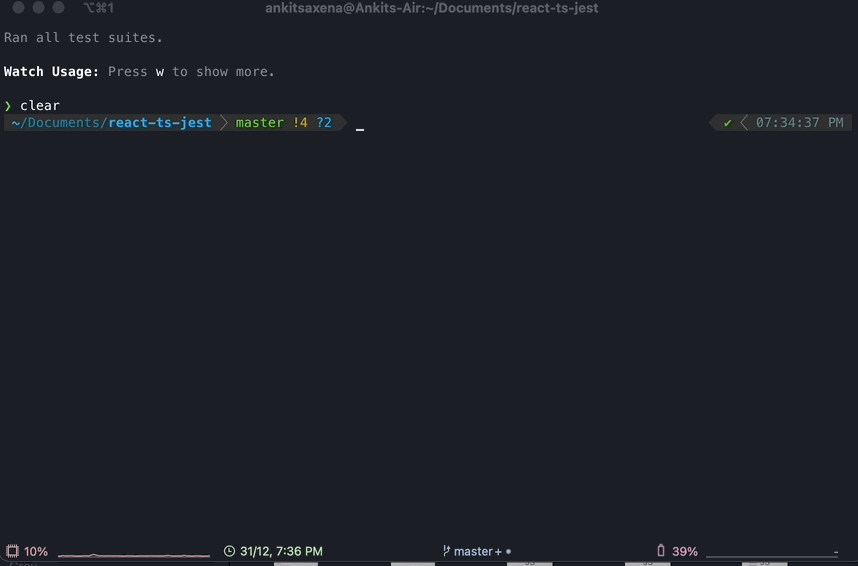

# React-ts--RTL
Source code for a blog that I wrote on medium about getting stated with react testing library

Medium Article Link - [Link to article](https://ankitsaxena21.github.io/Food-Ordering-App/)

Youtube Video Link - [Video Link](https://www.youtube.com/watch?v=_SybsO4URZ0)




## Installation

Install dependencies.

```bash
npm install
cd React-ts-RTL
npm install

```

Run tests.

```bash
npm test

```

Run app.

```bash
npm start

```

